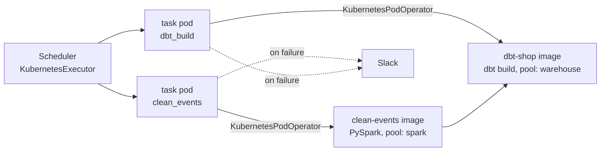

# airflow3-k8s-dbt-reference

Airflow 3 on Kubernetes orchestrating a daily data build: a PySpark job, then dbt, each in its own pod, with concurrency pools that protect the warehouse, retries with backoff, Slack alerts on failure, and backfills that are safe to rerun.

It is the fifth piece of a small end-to-end data platform for a fictional online coffee shop. It runs [pyspark-glue-ingestion](https://github.com/markotalledo/pyspark-glue-ingestion) and [dbt-ecommerce-warehouse](https://github.com/markotalledo/dbt-ecommerce-warehouse).



## Quickstart

```bash
make setup    # Airflow 3.3 and the Kubernetes provider, for local DAG tests
make test     # 11 tests: imports, pools, resources, templates, alerts
```

On a local cluster (needs Docker, kind, kubectl and Helm):

```bash
make cluster  # kind cluster with one worker
make images   # build the Spark and dbt images and load them into kind
make deploy   # official Airflow chart, the pods' service account, the pools
```

## DAGs

| DAG | Schedule | What it does |
|---|---|---|
| `shop_daily` | 06:00 UTC | `clean_events` rebuilds the last 3 event dates from raw events, then `dbt_build` rebuilds and tests the warehouse |
| `shop_full_refresh` | manual only | Rebuilds the incremental dbt models from scratch |

## Design decisions

- **Every step is its own pod, built by one factory.** `dags/shop/pods.py` sets image, resources, pool, timeout and cleanup in one place, so a new step cannot forget a memory request or skip the pool. Succeeded pods are deleted; failed pods are kept so you can inspect them.
- **Pools protect shared systems.** Every dbt run goes through the `warehouse` pool (2 slots) across every DAG. When several DAGs fire at the same minute, they queue in Airflow instead of piling queries onto the warehouse. A test fails if any dbt task skips the pool, and the DAG loader is given the declared pools so an unknown one is flagged.
- **The date comes from `data_interval_end`.** `execution_date` no longer exists in Airflow 3. A test fails if anything templates it.
- **Reruns are idempotent, so backfills are safe.** Both steps rewrite a window of dates instead of appending. Retrying a task, rerunning a day, or backfilling a month gives the same tables. `max_active_runs=1` keeps backfill runs from overlapping on the warehouse.
- **Full refresh is a separate, unscheduled DAG.** It is a deliberate action someone triggers and can see in the UI, not a flag that can end up in a scheduled run. It still waits for the same warehouse pool.
- **Memory limit, no CPU limit.** A memory limit stops a pod from taking down the node. A CPU limit mostly causes throttling on bursty Spark stages, so pods request CPU but are not capped.
- **Alerts say what failed and where.** The Slack message carries the DAG, task, try number, data interval and log link. Without a webhook configured it only logs, so local runs need nothing.

## Backfill

```bash
make backfill FROM=2026-01-01 TO=2026-01-31
```

This runs `airflow backfill create --max-active-runs 1 --reprocess-behavior completed`, one day at a time. Because each run rebuilds a window, the overlap between consecutive days is rewritten, not duplicated.

## Images

| Image | Built from | Notes |
|---|---|---|
| `clean-events` | `pyspark-glue-ingestion` installed from Git | Java 17, PySpark 3.5.4, `hadoop-aws` 3.3.4 for S3, credentials from the pod's service account (IRSA) |
| `dbt-shop` | `dbt-ecommerce-warehouse` source archive | Ships the DuckDB adapter and fixture to show the wiring; install your warehouse adapter for real data |

Both run as `nobody`.

## Repo layout

```
dags/shop_daily.py          the daily DAG
dags/shop_full_refresh.py   manual full rebuild
dags/shop/pods.py           pod factory and pool definitions
dags/shop/alerts.py         Slack failure callback
pools.json                  pools, imported with `airflow pools import`
docker/                     images for the Spark job and dbt
k8s/                        kind cluster, Helm values, service account
tests/                      DAG and alert tests, no cluster needed
```

CI runs the tests and renders the official Helm chart with `k8s/values.yaml` on every push.

## License

MIT
